--- 
# 오라클 클라우드 - 네이티브 개발 작업반 #

## Wercker를 사용하여 Node.js-MongoDB 컨테이너 패키지 애플리케이션을 빌드하고 Oracle Container Cloud Service에 배포합니다. ##

### 이 자습서 정보 ###
**Wercker**는 Kubernetes &amp; Microservice 배치 용 Docker-Native CI / CD 자동화 플랫폼입니다. Wercker는 Docker 컨테이너와 통합되어 애플리케이션 코드를 패키지화하고 서버간에 손쉽게 이동할 수 있습니다. 각 빌드 아티팩트는 Docker 컨테이너가 될 수 있습니다. 사용자는 Docker Hub 또는 그의 개인 레지스트리에서 컨테이너를 가져 와서 운송하기 전에 코드를 빌드 할 수 있습니다. SaaS 플랫폼을 통해 개발자는 코드를 자주 테스트하고 배포 할 수 있습니다. 번들 덤프보다는 소프트웨어 업데이트를 준비 할 때 점차적으로 밀어 넣을 수 있습니다. 코더가 지속적인 통합을 쉽게 수행 할 수있게합니다. 개발자가 코드베이스를 변경할 때마다 끊임없이 테스트를 거쳐 소프트웨어가 작동 될 때 소프트웨어가 깨지지 않도록하는 소프트웨어 엔지니어링 실습입니다. 

**Oracle Container Cloud Service**는 엔터프라이즈 급 컨테이너 인프라를 쉽고 빠르게 작성할 수있는 방법을 제공합니다. Oracle Public Cloud에서 Docker 컨테이너 기반 애플리케이션을 구성, 배포, 조율 및 관리하기위한 포괄적 인 툴링을 제공합니다. 이 제품은 즉시 실행할 수있는 컨테이너 기반 인프라를 신속하게 프로비저닝하고 테스트 인프라로 사용할 수 있으며 수명이 제한적이거나 장시간 컨테이너 애플리케이션을위한 프로덕션 환경으로 작동하도록 설계되었습니다. 

Oracle Container Cloud Service는 스택이라는 기능을 제공합니다. 스택은 단일 엔터티로 관리되는 조정 된 방식으로 서비스 집합을 실행하는 데 필요한 모든 구성과 기본 배포 옵션을 포함합니다. 스택 자체는 컨테이너 나 컨테이너에서 실행되는 이미지가 아니라 오라클 컨테이너 클라우드 서비스를 사용하여 생성, 배포 및 관리 할 수있는 고급 구성 객체입니다. 

이 예제에서 stack은 MongoDB 컨테이너와 컨테이너 화 된 샘플 Node.js 애플리케이션을 포함한다. 

**건축물**

이 자습서에서는 다음 작업을 수행하는 방법을 보여줍니다. 

- Docker 공용 저장소에 Node.js 샘플 응용 프로그램을 빌드, 패키지화 및 푸시하기위한 Wercker 응용 프로그램 (CI / CD) 작성 
- 컨테이너 화 된 Node.js 샘플 애플리케이션을 기반으로 Oracle Container Cloud Service 생성 
- Node.js 샘플 애플리케이션과 MongoDB 서비스가 포함 된 Oracle Container Cloud Stack을 작성하십시오. 
- Oracle Container Cloud Service에 스택 배치 

### 선수 과목 ###

- [Github] (https://github.com) 계정 
- [Oracle Public Cloud Service] (컨테이너 클라우드 서비스를 포함한https://cloud.oracle.com) 계정 
- [Docker] (https://cloud.docker.com/) 계정에 Docker 레지스트리가 있습니다. 

---- 
#### Oracle Container Cloud Service 인스턴스 생성 

이미 Container Cloud Service 인스턴스가있는 경우이 단계를 건너 뛸 수 있습니다. 

먼저 Oracle Container Cloud Service를 작성하십시오. [https://cloud.oracle.com/sign-in](https://cloud.oracle.com/sign-in)에 로그인하십시오. 데이터 센터를 선택한 다음 ID 도메인과 자격 증명을 제공하십시오. 로그인이 성공하면 대시 보드가 표시됩니다. 컨테이너 타일을 찾아 햄버거 아이콘을 클릭하십시오. 드롭 다운 메뉴에서**서비스 콘솔 열기**를 클릭하십시오. 

이 콘솔을 처음 실행하는 경우 마법사 페이지에서**콘솔로**이동**버튼을 클릭하십시오. 그렇지 않으면**서비스 생성**버튼을 즉시 클릭하십시오. 

세부 정보 페이지에서 서비스를 구성하십시오. 

+**서비스 이름**: 인스턴스의 이름입니다. 예 :*testOCCS*
+**설명**: 서비스에 대한 간단한 설명. 이 서비스의 목적을 설명하는 어떤 것도 될 수 있습니다. 
+**SSH 공개 키**: SSH 키 쌍의 공개 키를 정의하는 데 필요한 작업자 및 마스터 노드에 연결합니다.**편집**버튼을 누릅니다. 공개 키 파일이 있거나 이미 사용하고 싶다면 공개 키 파일 또는 해당 내용의 사본을 키 값 텍스트 필드로 선택하십시오. 그렇지 않으면 테스트 목적으로 새 테스트를 생성하는 것이 좋습니다.**새 키 만들기**옵션을 선택하고**Enter**를 클릭하십시오. 새로 생성 된 키 쌍을 다운로드 할 수있는 팝업 대화 상자가 열립니다. 나중에이 서비스를 사용하려면이 키 쌍이 있어야합니다. 키 쌍을 어디에 저장했는지 잊어 버린 경우 [새 암호를 추가 할 수 있습니다 (https://docs.oracle.com/cloud/latest/computecs_common/OCSUG/GUID-65AA23D4-5F57-4EF6-9704- C8E16932C0AD.htm # OCSUG233)에서 내 서비스 대시 보드를 사용합니다. 

+**측정 빈도**: 귀하의 가입을 기반으로합니다. 기본값을 그대로 두십시오. 
+**관리자 사용자 이름**: 컨테이너 클라우드 서비스 콘솔의 관리자 사용자 이름입니다. 기본값을 그대로 둘 수 있습니다. 
+**관리자 암호**: 관리자 암호. 귀하가 선택한 비밀번호를 기록하십시오. 
+**Worker node Compute Shape**: 서비스 용량. 이 샘플의 경우 최소값 이상이면 충분합니다. 
+**작업자 노드의 수**: Docker 컨테이너를 실행하는 작업자 노드의 수. 이 샘플에서는 기본 1 노드로 충분합니다. 하나의 노드가 하나의 OCPU 만 공유하더라도 더 많은 컨테이너를 실행할 수 있습니다. 모든 작업자 노드에는 실행중인 응용 프로그램을 공개적으로 사용 가능하게하는 공용 IP 주소가 할당되어 있습니다. 
+**Worker Node 데이터 볼륨 크기 (GB)**: 기본값을 유지하십시오. 

모든 세부 사항이 구성되면**다음을 클릭하십시오**. 

구성을 다시 확인하고**다음을 클릭하여 인스턴스 제공 요청을 제출하십시오**. 

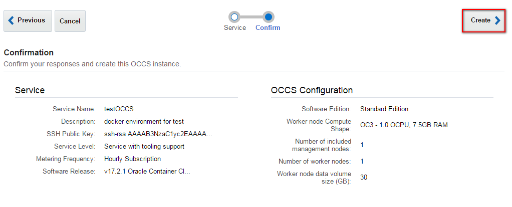

컨테이너 클라우드 서비스 프로비저닝이 완료되면 Docker에 가입하고 Wercker 연속 통합 설정을 만들 수 있습니다. 

#### Docker에 가입하십시오. 

이미 Docker 계정이있는 경우이 단계를 건너 뛸 수 있습니다. 

귀하의*Docker ID*를 선택하는 것보다 [https://cloud.docker.com/](https://cloud.docker.com/)로 가십시오. 이메일 주소와 원하는 비밀번호를 입력하십시오.**가입**을 클릭하십시오. 

이제받은 편지함을 확인하면 비슷한 이메일을 받아야합니다.**확인 이메일**버튼을 클릭하십시오. 

새로운 Docker 계정을 사용하여 지금 로그인 할 수 있습니다. 

#### 포크 Node.js 소스를 github 저장소에 샘플로 만듭니다. 

먼저 계정을 사용하여 [https://github.com] (https://github.com)에 로그인하고 [https://github.com/nagypeter/nodejs-mongodb &#39; -crud] (https://github.com/nagypeter/nodejs-mongodb-crud). Github 계정이없는 경우에는 [가입]하십시오 (https://github.com/join?source=header-home). 

이제**Fork**을 클릭하십시오. 

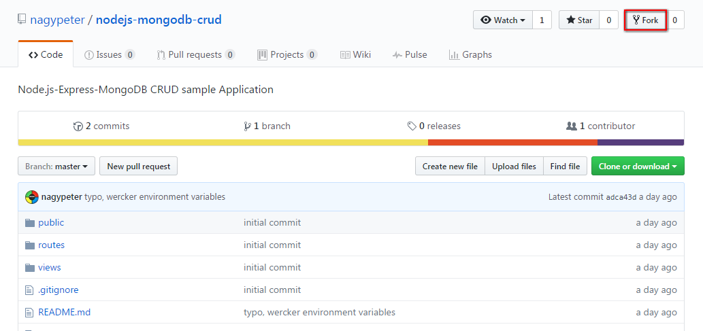

포크가 완료되면 다음 단계로 이동합니다. 

#### Github 계정을 사용하여 Wercker에 가입하십시오. 

가져 오기가 완료되면 [https://app.wercker.com] (https://app.wercker.com)로 가서 github 계정을 사용하여 서명하십시오.**LOG IN WITH GITHUB**버튼을 클릭하십시오. 

github에 이미 로그인 한 동일한 브라우저를 사용하는 경우*응용 프로그램*github 페이지에 직접 연결됩니다. 그렇지 않으면 github에 로그인하기 위해 github의 자격 증명을 입력하십시오.**승인 응용 프로그램**버튼을 클릭하여 Wercker의 요청을 수락하십시오. github의 프로필 설정을 사용하여 언제든지 Wercker의 승인 요청을 취소 할 수 있습니다. 

인증 성공 후*https : //app.wercker.com*로 리디렉션됩니다. 

#### Node.js 샘플 응용 프로그램을 포함하여 Docker 컨테이너를 작성하기위한 Wercker 응용 프로그램 만들기 

이제 Wercker 응용 프로그램을 만들 차례입니다. Wercker는 Node.js 샘플 응용 프로그램 비트가 포함 된 완전한 Docker 컨테이너를 생성하고 푸시하는 지속적인 통합 도구 역할을합니다. 

Wercker의 환영 페이지로 돌아가서**첫 번째 애플리케이션 만들기**버튼 또는**+ 작성**드롭 다운 목록을 클릭하고*애플리케이션*을 선택하십시오. 

먼저 소스로 사용할 저장소를 선택하십시오. 기본적으로 Github 제공 업체와 사용 가능한 리포지토리가 표시됩니다.*node-mongodb-crud*를 선택하고**선택한 repo 사용**을 클릭하십시오. 

개인 저장소의 경우 액세스 방법을 정의해야합니다. 샘플 저장소가 공용으로 작성되었으므로 기본 체크 아웃 방}을 남겨 둘 수 있습니다.**다음 단계**를 클릭하십시오. 

마지막으로 응용 프로그램의 공개 여부를 선택할 수 있습니다. 기본값을 그대로두면 응용 프로그램이 비공개가됩니다.**마침**을 클릭하여 응용 프로그램을 만듭니다. 

다음 페이지에서는 응용 프로그램의 언어에 따라 특정 wercker.yml을 생성합니다. 이 샘플 애플리케이션에는 이미 하나가 있으므로**빌드 지금 트리거**링크를 클릭하십시오. 

이제 기본*build*파이프 라인이 시작되어*wercker.yml*에 정의 된 간단한*npm install*이 실행되어 Node.js 샘플 응용 프로그램에 필요한 노드 모듈을 얻습니다. 그 결과는 성공적 일 것입니다. 각 단계 (오른쪽)를 열면 세부 정보를 얻을 수 있습니다. 

Before you move forward please inspect the *wercker.yml*. The source is available under your github repository. Open a new browser (tab) and go directly to *https://github.com/<YOUR_GITHUB_USERNAME>/nodejs-mongodb-crud/blob/master/wercker.yml*. The configuration should be the same:

	box: node:6.10
	build:
	  steps:
	    # A step that executes `npm install` command
	    - npm-install
	push:
	  steps:
	    # Push to public docker repo
	    - internal/docker-push:
	        username: $DOCKER_USERNAME
	        password: $DOCKER_PASSWORD
	        tag:  $DOCKER_TAG
	        repository: $DOCKER_REPOSITORY
	        registry: https://index.docker.io/v1/
	        cmd: node pipeline/source/app.js

*wercker.yml*은 자동화 파이프 라인의 구성을 수행하려는 단계의 모음으로 정의합니다. 
*wercker.yml*에서는 원하는 파이프 라인을 지정할 수 있습니다. wercker dev 명령을 사용하여 CLI로 실행할 때만 실행되는`dev`라는 특별한 파이프 라인이 있습니다. 파이프 라인 이름의 예 :*build-base-container*,*build*,*push-to-registry*등 

파이프 라인은이 예제에서와 같이 자체 기본 상자 (Docker 컨테이너)를 가질 수 있습니다.*node : 6.10*공식 Node Docker 컨테이너. 파이프 라인마다 다른 기본 상자를 사용할 수 있습니다. 

이 구성에서 볼 수 있듯이*npm-install*빌드를 실행하는 기본 파이프 라인*build*와 예약 된 파이프 라인이 아닌*push*단계가 있습니다. 다음 단계에서*push*파이프 라인을 생성합니다. 이것이 첫 번째 빌드에서 Docker 푸시 단계를 볼 수없는 이유입니다. 

환경 변수 사용법에 유의하십시오.*push*파이프 라인이 끝나면이 변수를 만들고 값을 설정합니다. 

이제**워크 플로우**탭으로 전환하십시오. 

Wercker에서 프로젝트를 만들 때 언급했듯이 빌드 파이프 라인을 실행하는 Git 훅을 사용하여*빌드*워크 플로를 만듭니다. 즉, github 저장소로 변경 사항을 푸시 할 때마다 새 빌드가 트리거됩니다. 이제 Docker 컨테이너 이미지 푸시를 Docker 레지스트리에 수행 할 새로운 파이프 라인을 추가하십시오.*새 파이프 라인 추가*를 클릭하십시오. 

+**이름**:*push-docker*(그러나 다른 것은 될 수 있음) 
+**YML 파이프 라인 이름**: 우리는 이미*wercker.yml*에서이 파이프 라인을 정의했기 때문에*push*가되어야합니다. 
+**Hook type**: Git push를 무시하도록 기본값을 남겨 둡니다. 이 구성을 이미 구축 한 후에이 파이프 라인을 추가 할 것입니다. 

마지막으로**생성**을 클릭하십시오. 

새로운*push-docker*파이프 라인의 세부 정보 페이지에서 필요한 환경 변수를 즉시 추가 할 수 있습니다. 

+**DOCKER \ _USERNAME**= 귀하의 Docker 사용자 이름 
+**DOCKER \ _PASSWORD**= 귀하의 도커 비밀번호 
+**DOCKER \ _TAG**= 최신 
+ **DOCKER\_REPOSITORY** = <YOUR\_DOCKER\_USERNAME>/nodejs-mongodb-crud

새 변수를 추가해야하는 경우 현재 행을 저장하고 새 행을 추가하는****추가**버튼을 클릭하십시오.**Protected**체크 박스를 사용하면 안전하게 비밀번호를 저장할 수 있습니다. 

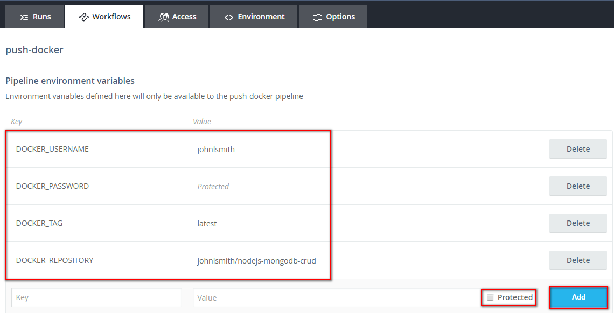

워크 플로 편집기로 돌아가려면**워크 플로**탭을 다시 클릭하고 워크 플로를 편집하십시오. previosly 만든*push-docker*파이프 라인을 추가하려면*build*파이프 라인 다음에 파란색 더하기 아이콘을 클릭하십시오. 분기의 경우*를 기본값으로두고**Execute pipeline**드롭 다운 목록에서*push-docker*파이프 라인을 선택하십시오.**추가**를 클릭하십시오. 

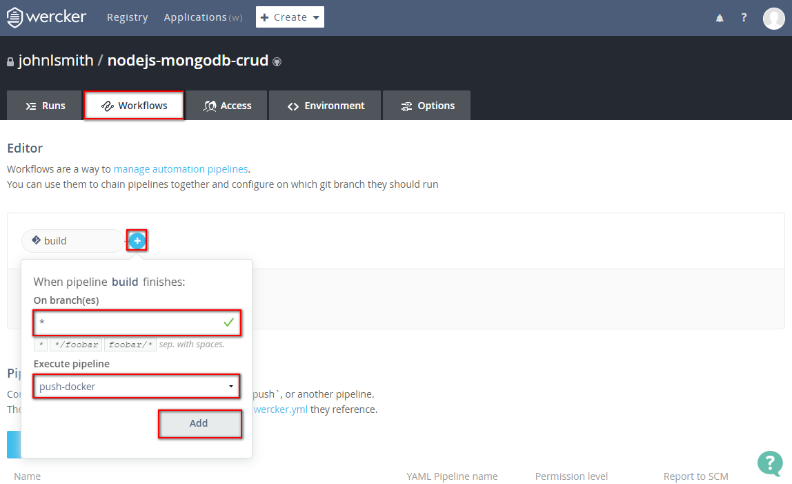

워크 플로를 실행하려면**Runs**로 돌아가서 마지막으로 성공한 빌드를 선택하십시오. 

**Action**버튼을 클릭하고**이 파이프 라인을 다시 실행**메뉴 항목을 선택하십시오. 

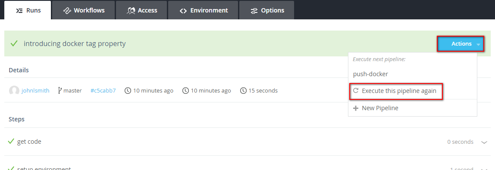

적절한 이유를 쉽게 알 수있는 메시지를 입력하고**Execute pipeline**버튼을 누릅니다. 

Runs 탭을 다시 클릭하고*build*및*push-docker*파이프 라인의 성공적인 실행을 확인합니다. 

빌드 및 푸시 도커가 완료되면 [https://cloud.docker.com] (https://cloud.docker.com)에 로그인 한 브라우저 (탭)로 돌아갑니다.**리포지토리**를 클릭하십시오. 

Now you should see a new image called <YOUR\_DOCKER\_USERNAME>/nodejs-mongodb-crud. This image based on the box defined in *wercker.yml* but Wercker baked the Node.js sample application into this image during the workflow. Which results a test/production/etc. ready container.

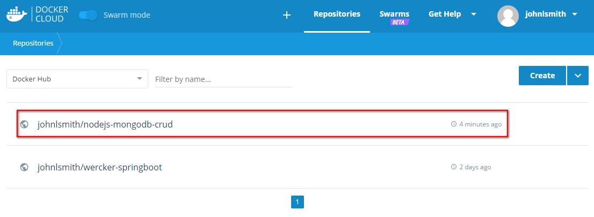

다음 단계에서는이 Docker 저장소를 사용하여 Oracle Container Cloud Service에 새 컨테이너를 배포합니다. 

#### Node.js 샘플 애플리케이션 컨테이너를 기반으로 Oracle Container Cloud Service를 작성하십시오. 

이 실습의 시작 부분에서 컨테이너 클라우드 서비스를 작성한 브라우저 (탭)를 찾으십시오. 시간 제한에 도달하거나 브라우저 (탭)를 잃어버린 경우 [https://cloud.oracle.com/sign-in](https://cloud.oracle.com/sign-in)로 다시 로그인하십시오. 데이터 센터를 선택한 다음 ID 도메인과 자격 증명을 제공하십시오. 로그인이 성공하면 대시 보드가 표시됩니다. 컨테이너 타일을 찾아 햄버거 아이콘을 클릭하십시오. 드롭 다운 메뉴에서**서비스 콘솔 열기**를 클릭하십시오. 

이제*testOCCS*(또는 다른 이름을 지정한 경우 다른 이름) Container Cloud Service 인스턴스를 준비해야합니다. 왼쪽에있는 햄버거 아이콘을 클릭하고 드롭 다운 메뉴에서**컨테이너 콘솔**을 선택하십시오. 

인증이 설정되지 않은 이유 때문에 보안 경고가 표시됩니다. 그것을 무시하고 페이지를 열 수 있습니다. 컨테이너 클라우드 서비스에 대한 관리자 자격 증명을 입력하십시오. 가이드를 따라 간다면 사용자 이름은*admin*이어야합니다.**로그인**을 클릭하십시오. 

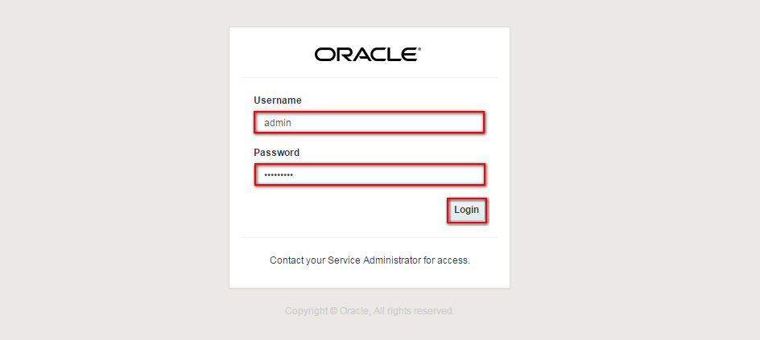

먼저 새 서비스를 정의해야합니다. 새로운 서비스는 호스트에서 Docker 컨테이너를 실행하는 데 필요한 모든 구성과 기본 배포 옵션으로 구성됩니다. 왼쪽 탐색 메뉴에서**서비스****를 클릭하고**새 서비스**버튼을 클릭하십시오. 

새 서비스를 정의하려면 다음 매개 변수를 입력하십시오. 

+**서비스 이름**:*employee-nodejs*
+**서비스 설명**: 귀하의 서비스를 설명하는 모든 것. 
+**Image**:*YOUR \ _DOCKER \ _USERNAME / nodejs-mongodb-crud*(레지스트리에 저장된 Docker 이미지의 이름)는 Docker 레지스트리를 검사 할 때 previos 단계를 참조하십시오. 
+**포트**: 우선 오른쪽의 포트를 선택합니다. 그런 다음 Ports 속성 목록을 채 웁니다. 

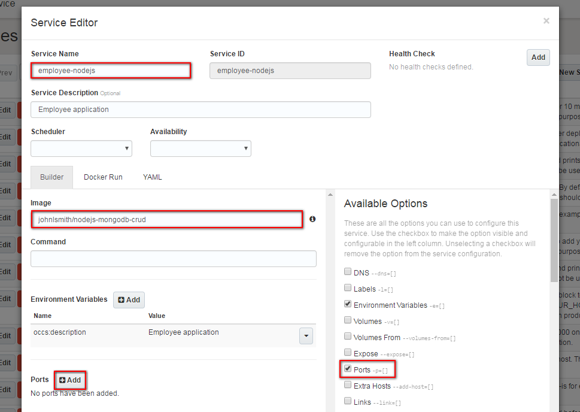

*포트***+ 추가**버튼이 나타나면 포트 매핑을 정의하려면 클릭하십시오. 이 포트 매핑을 사용하면 내부 도커 컨테이너의 포트 리디렉션을 호스트의 다른 포트로 사용할 수 있습니다. 호스트의 8091 포트에 매핑 할 내용을 3000에서 수신 대기하도록 구성된 Node.js 샘플 응용 프로그램. 

+**호스트 포트**: 8091 
+**컨테이너 포트**: 3000 
+**프로토콜**: TCP 

**저장**을 클릭하십시오. 

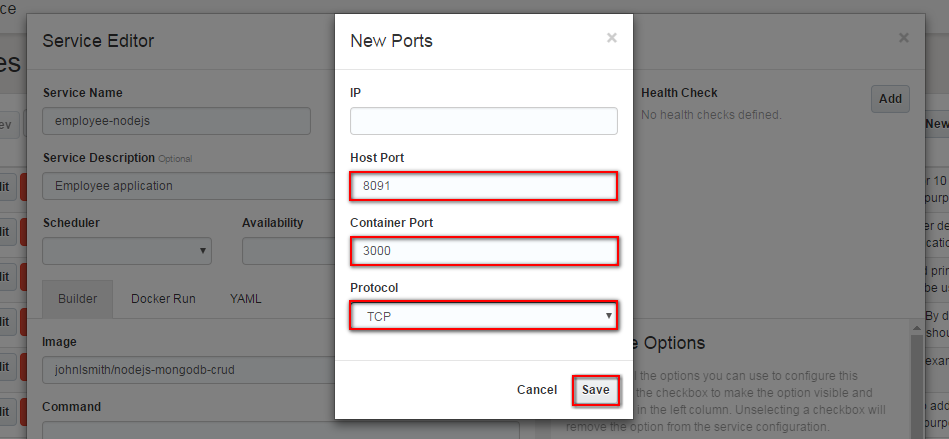

서비스 세부 정보 페이지에서**저장**을 클릭하여 서비스를 저장하십시오. 

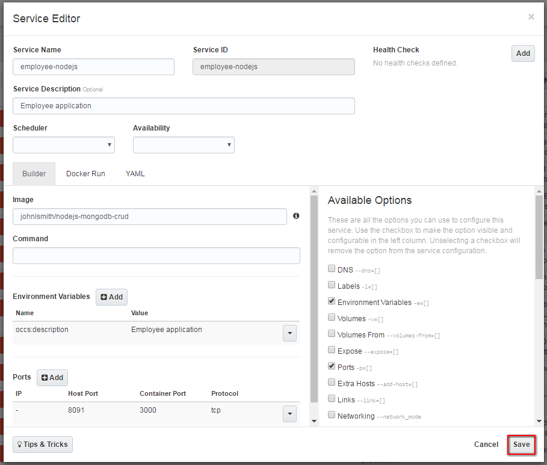

#### Oracle Container Cloud Service Stack을 작성하여 Node.js 샘플 및 MongoDB 서비스 (컨테이너)를 단일 애플리케이션으로 관리하십시오. 

이제 Wercker는 서비스로 사용할 수있는 Node.js 샘플 애플리케이션 컨테이너를 만들었습니다. 스택을 생성 할 수 있도록 MongoDB가 기본적으로 생성됩니다. 왼쪽의**스택**메뉴를 클릭하고**새 스택**버튼을 클릭하십시오. 

스택 이름을 입력하십시오 :*employee-nodejs-mongodb*. 드래그 앤 드롭**MongoDB**그리드 영역 서비스. 

MongoDB 서비스 구성 페이지가 열립니다. 기본 설정을 그대로두고**저장**을 클릭하십시오. 

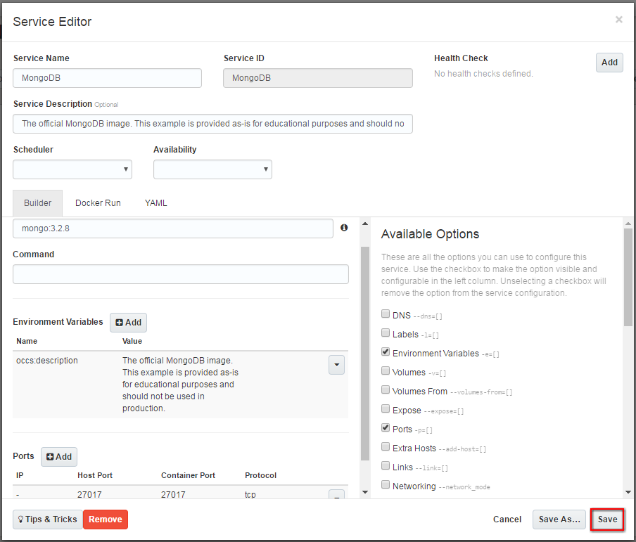

*employee-nodejs*서비스를 찾아 그리드 영역으로 끌어서 놓으십시오. 서비스 구성 페이지가 열립니다.**링크**옵션을 확인하십시오. Builder 영역을 아래로 스크롤하고*링크*옆의**+ 추가**버튼을 클릭하십시오. 

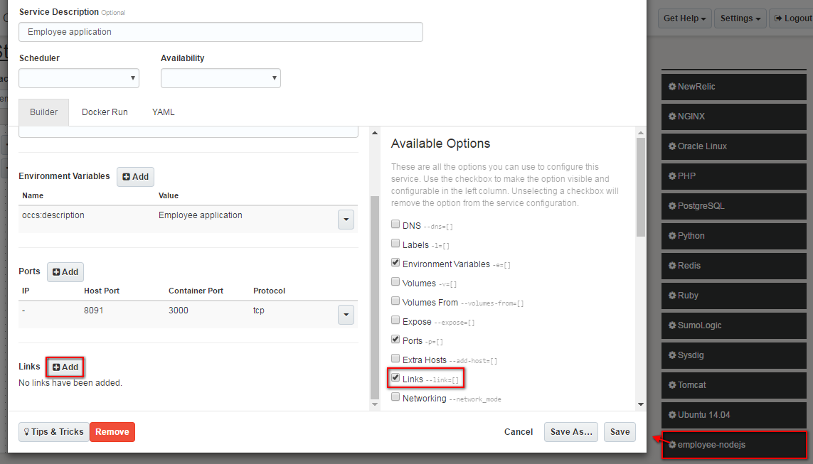

여기서 컨테이너간에 (네트워크) 링크를 구성해야합니다.*Service*는 이전 단계에서 MongoDB 구성을 변경하지 않은 경우 MongoDB 인 정의 된 Container Cloud Service를 참조합니다. 마지막으로*Alias ​​*는 서비스의 호스트 이름입니다. 이것은 Node.js 샘플 응용 프로그램 서비스에서 MongoDB 인스턴스에 액세스하기 위해 MongoDB 드라이버를 구성하는 데 필요한 것입니다.**저장**을 클릭하십시오. 

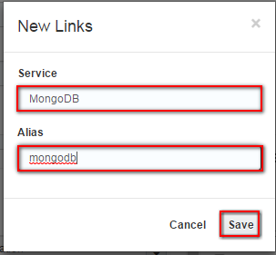

이 스택의*employee-nodejs*구성을 갱신하려면**저장**을 누르십시오. 

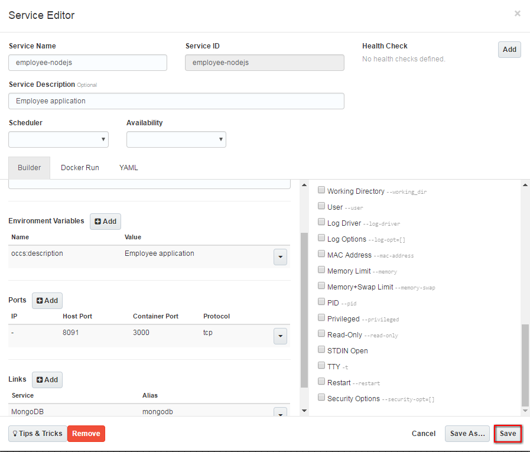

다이어그램을 확인하고 저장을 클릭하여*employee-nodejs-mongodb*stack을 작성하십시오. 

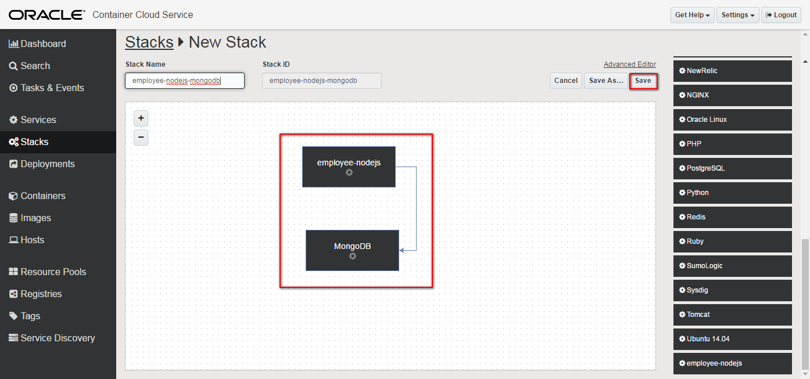

#### Oracle Container Cloud Stack 배포 및 Employee Node.js 샘플 애플리케이션 테스트 

스택이 준비되었으므로 Employee Node.js 샘플 응용 프로그램을 배포하고 테스트 할 차례입니다. 새로 생성 된*employee-nodejs-mongodb*스택을 찾아 녹색**Deploy**버튼을 클릭하십시오. 

오케스트레이션의 기본 구성을 그대로두고**배포**를 클릭합니다. 

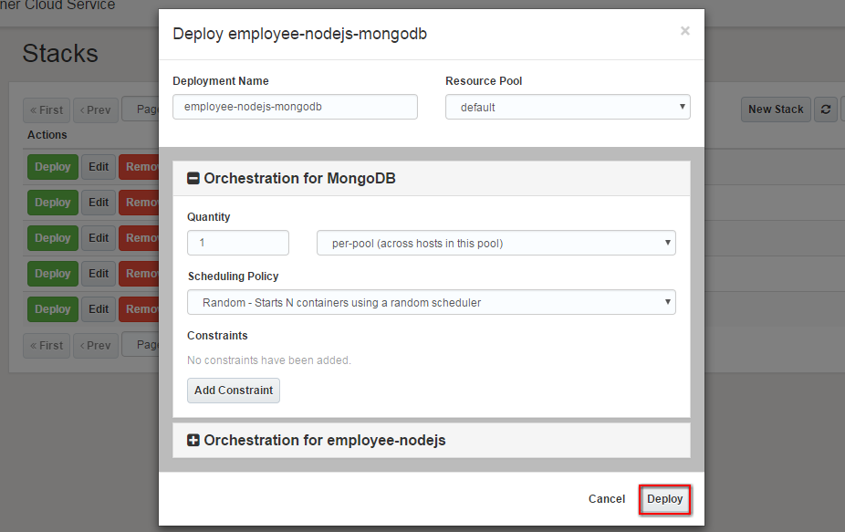

스택 배포 세부 정보 페이지가 열립니다. 스택이 가동되어 실행될 때까지 기다립니다. 빨간색 중지 버튼을 제외한 모든 것이 녹색이어야합니다. 시작 프로세스를주의 깊게 관찰하면 Oracle Container Cloud Service가 Docker 허브에서*johnlsmith / nodejs-mongodb-crud*이미지를 가져올 때 확인할 수 있습니다. 

응용 프로그램을 테스트하려면 호스트 환경의 공용 IP 주소를 얻어야합니다.*employee-nodejs*서비스가 배치 된 호스트 이름을 누르십시오. 

public_ip 주소 속성을 찾아서 기록하십시오. 

새 브라우저 (탭)를 열고 호스트의 공용 IP 주소를 입력하거나 복사 한 다음 구성된 8091 포트를 추가하십시오. 예 :`141.144.137.89 : 8091` 아래의 웹 페이지를 얻어야합니다. MongoDB를 테스트하려면**새 직원 추가**버튼을 클릭하십시오. 

이름, 제목 및**저장**을 입력하십시오. 

#### Employee Node.js 샘플 애플리케이션 변경 

To modify something small on the application's home page open a new browser (tab) and edit for example *https://github.com/<YOUR\_GITHUB\_USERNAME>/nodejs-mongodb-crud/blob/master/views/index.jade* file.Click the Edit icon.

다음 부분을 수정하십시오. 

	h1 <strong>Node.js + MongoDB app</strong>

귀하의 이름을 예를 들면 다음과 같습니다 : 

	h1 <strong>Node.js + MongoDB app running on Oracle Container Cloud</strong>

커밋 메시지를 입력하고**Commit changes**버튼을 클릭하십시오. 

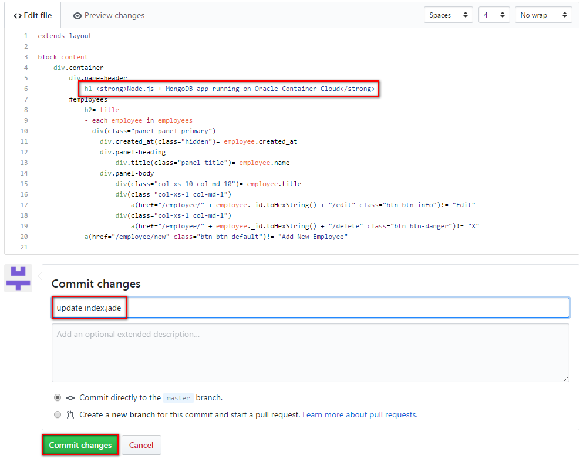

Wercker가 이미 열려있는 브라우저 (탭)를 찾고 커밋에 의해 시작된 빌드 진행 상황을 확인하십시오. 

빌드 및 푸시가 완료되면 Oracle Container Cloud Services 콘솔로 돌아가서 왼쪽 메뉴에서 컨테이너 항목을 선택하십시오.**name**에*employee-nodejs*문자열이 포함 된 컨테이너를 찾으십시오.**해당 컨테이너를 중지하십시오. 

컨테이너가 멈 추면 제거하지 마십시오. 

스택의 기본 구성은 누락 된 서비스를 제거하고 즉시 배포합니다. 이름에*employee-nodejs-mongodb*가 포함 된 배치를 누르십시오. (그 동안*employee-nodejs*서비스가 다시 나타나는 경우이 서비스는 동일한 스택의 일부이므로 배포 링크를 사용할 수도 있습니다.) 

*employee-nodejs-mongodb*스택 배치 세부 사항 페이지로 이동합니다. Oracle Container Cloud Service가 Docker 허브에서 이미지의 새 버전을 가져 오는 시점을 신속하게 확인할 수 있습니다. 서비스가 시작되어 실행될 때까지 기다린 후 세부 정보 페이지에 모든 것이 녹색으로 표시됩니다. 

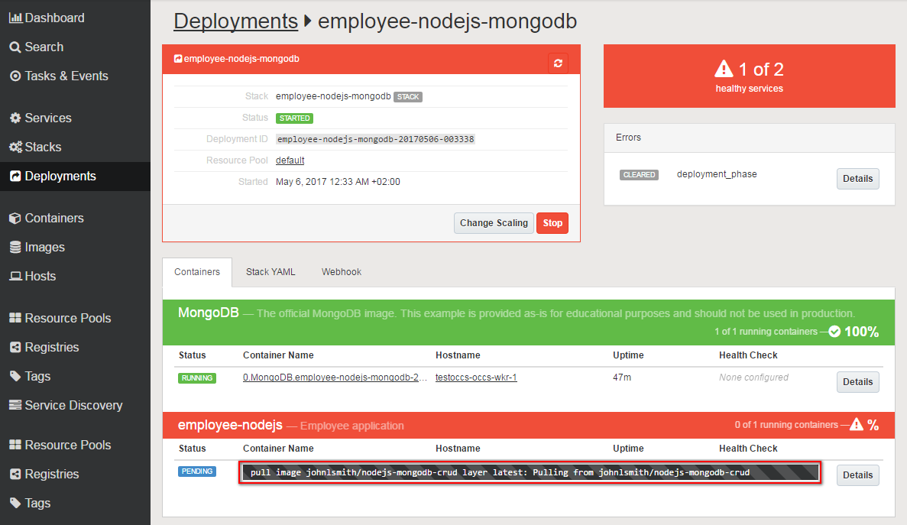

Employee 샘플 응용 프로그램이 열린 브라우저 (탭)를 변경하고 페이지를 다시로드하고 제목이 변경되었는지 확인하십시오. 

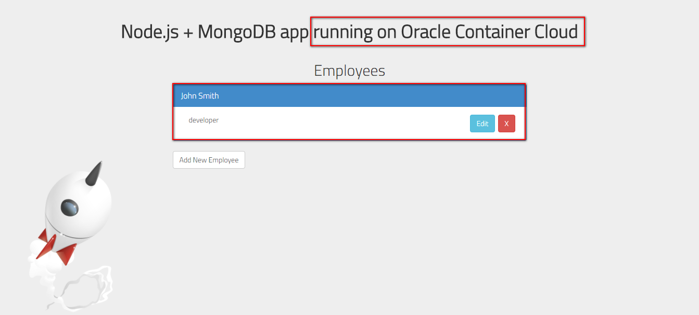

MongoDB 서비스가 다른 컨테이너에서 실행되기 때문에 여전히 데이터를 사용할 수 있습니다. 
