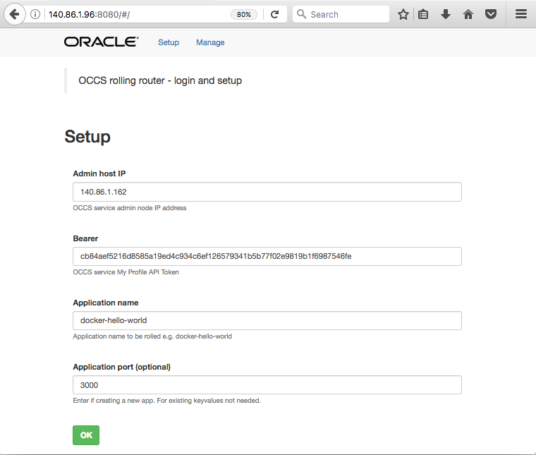
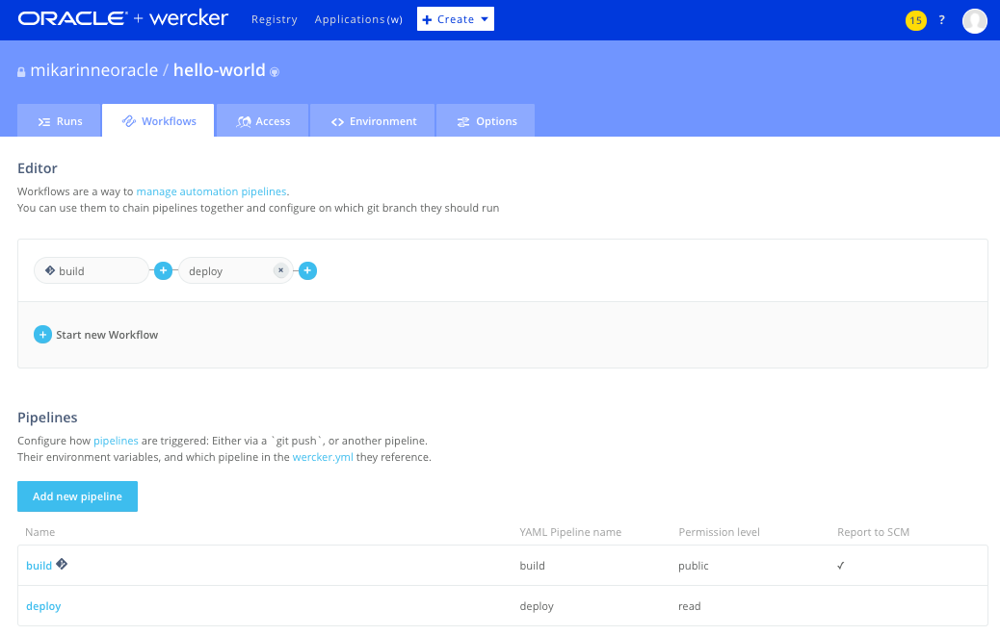
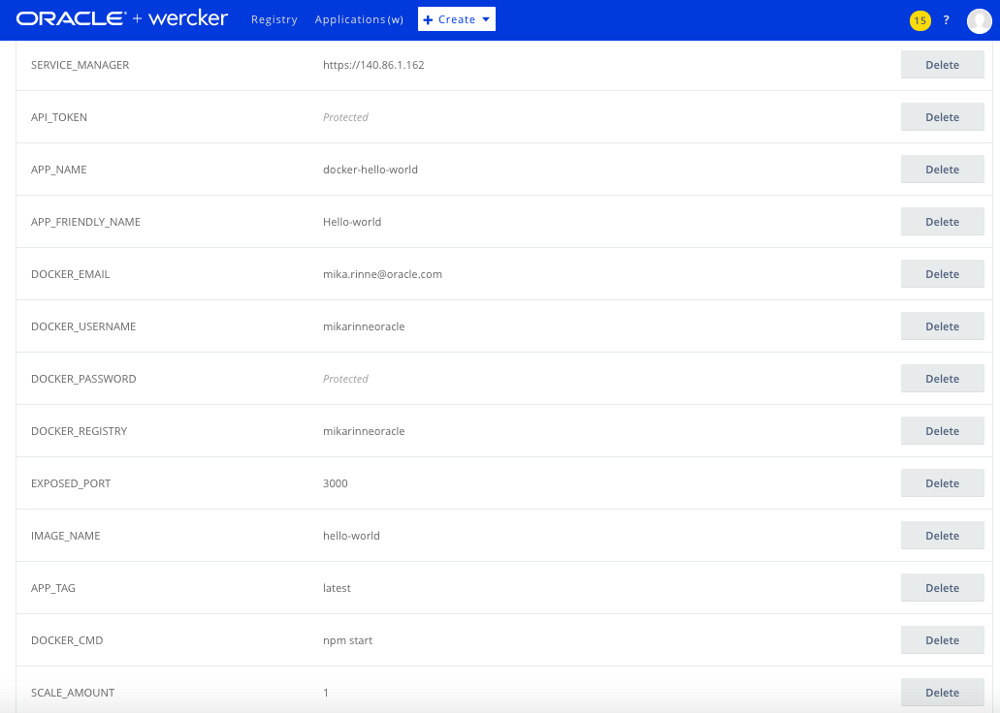
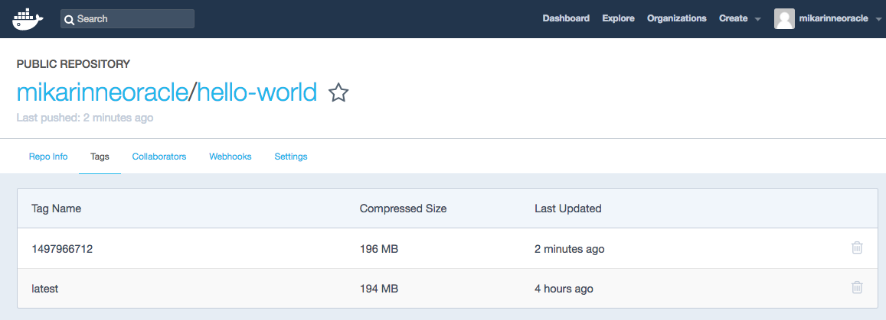
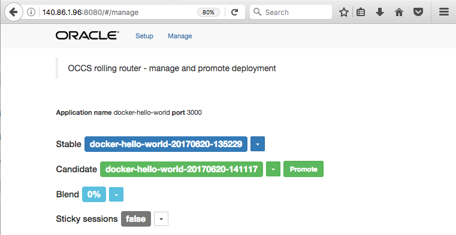
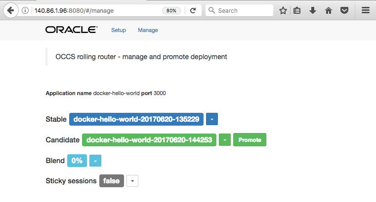
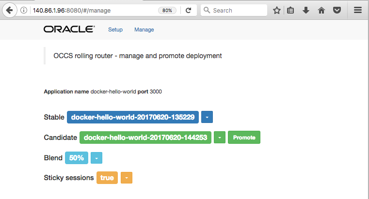
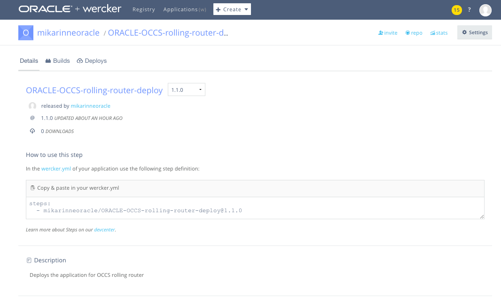

# Wercker로 라우터 롤링 세션

## 롤링 라우터의 끈적한 세션 서비스 배포

### 저장소 복제
<pre>
mkdir docker-images
git clone git@github.com:oracle/docker-images.git docker-images
cd docker-images/ContainerCloud
</pre>

### Docker Hub에 로그인하십시오.
<pre>
docker login
</pre>
<pre>
Login with your Docker ID to push and pull images from Docker Hub. If you don't have a Docker ID, head over to https://hub.docker.com to create one.
Username:
Password:
Login Succeeded
</pre>

### Docker 허브 계정을 사용하도록 작성기 구성
<pre>
REGISTRY_NAME ?= your_docker_hub_username
</pre>

### 이미지 빌드
<pre>
cd images/rolling-router-sticky-sessions
make
</pre>

이렇게하면 Docker-hub에 이미지가 업로드됩니다. 

### OCCS 서비스 만들기
<pre>
version: 2
services:
  rolling-router-sticky:
    image: '<b>mikarinneoracle</b>/rolling-router-sticky-sessions:0.2'
    environment:
      - 'OCCS_API_TOKEN={{api_token}}'
      - KV_IP=172.17.0.1
      - KV_PORT=9109
      - APP_NAME=docker-hello-world
      - 'occs:availability=per-pool'
      - 'occs:scheduler=random'
    ports:
      - '80:80/tcp'
      - '8080:8080/tcp'
</pre>

If you haven't build the image of your own, you can use the YML above as is.

Deploy the service.

## GUI를 사용하여 롤링 라우터 고정 세션 키 값 배포

### 기존 애플리케이션의 GUI 로그인 및 키 값
## Wercker CI / CD 설정하기
### Wercker 용 Hello World 애플리케이션 기본 이미지 빌드하기
Here's the <a href="https://github.com/mikarinneoracle/docker-brew-ubuntu-core/blob/dist/trusty/Dockerfile#L50">Dockerfile</a> for the forked Ubuntu project with the following additions to enable the utilities along with Node.js in the Ubuntu image:
<pre>
RUN sudo apt-get -y install libc-dev-bin libc6 libc6-dev
RUN sudo apt-get install -y recode
RUN sudo apt-get install -y jq
RUN sudo apt-get install -y curl
RUN sudo curl -sL https://deb.nodesource.com/setup_7.x | sudo -E bash -
RUN sudo apt-get install -y nodejs
RUN sudo apt-get install -y build-essential
</pre>
<pre>
mkdir ubuntu
git clone git@github.com:mikarinneoracle/docker-brew-ubuntu-core.git ubuntu
cd ubuntu
git checkout dist
cd trusty
export tag=$(docker build -t ubuntu . | grep 'Successfully built' | tail -c 13)
docker tag $tag <b>mikarinneoracle</b>/ubuntu:trusty
</pre>

The <a href="https://github.com/mikarinneoracle/hello-world">source code</a> includes a Dockerfile with the following:
<pre>
FROM mikarinneoracle/ubuntu:trusty

# 앱 디렉토리를 만듭니다. 베커 기본값과 동일
# 앱 의존성 설치
# 번들 앱 소스
</pre>

You can clone the project and then build and push the image to Docker hub (change the repository bolded to match your Docker hub account):

<pre>
mkdir 안녕하세요. 세계 
git clone git@github.com : mikarinneoracle / hello-world.git hello-world 
cd hello-world 
내보내기 태그 = $ (docker 빌드 -t hello-world. | grep &#39;Successfully built&#39;| tail -c 13) 
docker tag $tag <b>mikarinneoracle</b>/hello-world:latest
</pre>

### Wercker 워크 플로 만들기

### 워크 플로우에 대한 Wercker 응용 프로그램 환경 값 작성
<pre>
  SERVICE_MANAGER:    OCCS admin url e.g. https://140.86.1.162
  API_TOKEN:          OCCS API token (bearer)
  APP_NAME:           docker-hello-world
  APP_FRIENDLY_NAME:  Hello-world  
  DOCKER_EMAIL:       Docker hub account email
  DOCKER_USERNAME:    Docker hub account username
  DOCKER_PASSWORD:    Docker hub account password
  DOCKER_REGISTRY:    Docker hub registry; typically the same as the username e.g. mikarinneoracle
  EXPOSED_PORT:       Hello world application host port e.g. 3000
  IMAGE_NAME:         Wercker.yml box name e.g. hello-world
  APP_TAG:            Wercker.yml box tag e.g. latest
  SCALE_AMOUNT:       OCCS scale amount e.g. 1
  DOCKER_CMD:         OCCS image command e.g. npm start (for Node.js)
</pre>

### 워크 플로로 첫 번째 빌드 시작

응용 프로그램 환경 변수를 설정 한 후에 아래와 같이 &#39;지금 빌드 실행&#39;링크를 클릭하여 첫 번째 빌드를 시작할 수 있습니다 : 

워크 플로가 시작되고 워크 플로가 실행됩니다. 

`timestamp` 태그가있는 Hello world 어플리케이션 후보 이미지 (즉, 배포 스크립트의 Wercker 환경 변수`$ WERCKER_MAIN_PIPELINE_STARTED`)가 작성되어 Docker 허브에 푸시되었습니다. 

새 이미지도 OCCS에 배포되었으며 Hello World 응용 프로그램의 후보 이미지가 실행 중이어야합니다. 

롤링 라우터 고정 세션 GUI가 응용 프로그램 후보의 OCCS에서 키 값 변경을 반영하도록 업데이트되었습니다. 

### 후보 이미지 홍보 및 브라우저에서 안정적인 애플리케이션 호출

롤링 라우터 고정 세션 GUI에서 승격 버튼을 클릭하여 후보를 &#39;안정적으로&#39;승격시킵니다. 결과는 안정 버전이 지금 Wercker에 의해 작성된 이미지이고 후보가 롤링 / 널인 것입니다. 

이제 브라우저에 새 탭을 열고 작업자 호스트 public_ip 주소 (예 :`http : // 140.86.1.96`)를 가리키는 URL을 열어 응용 프로그램의 안정 버전을 호출 할 수 있습니다. 

(배경색과 텍스트가 약간 다를 수 있음) 

페이지를 몇 번 새로 고침하여 응답하는지 확인할 수 있습니다. 

### 새로운 후보자 구성
<pre>
git add index.html
git commit -m 'v.1.0.1'
git push origin master
</pre>

Wercker는이 변경 사항을 자동으로 선택해야하며 Hello world의 새로운 후보 버전에 대한 워크 플로가 시작됩니다. 

새 태그가있는 후보 이미지를 Docker 허브에 업로드해야합니다. 

그것은 OCCS에서 전개되고 시작되어야하며 이제는 안정적이고 후보자가 모두 실행되어야합니다. 

이제 롤링 라우터 고정 세션 GUI가 후보와 함께 업데이트되어 애플리케이션 후보에 대한 OCCS 키 값의 변경 사항을 반영해야합니다. 

### 후보 버전으로로드 보내기

두 버전이 모두 실행 중이기 때문에 후보 버전을로드하여 테스트 할 수 있습니다. 
이렇게하려면 블렌드 비율을 50 %로 조정하십시오. 

이제 근로자 호스트 public_ip 주소에 대한 다른 요청 (예 :http://140.86.1.96)은 후보 버전으로 가야합니다. 

문제를 보려면 페이지를 다시로드하십시오. 예를 들어 혼합 비율을 100으로 설정하면 모든 요청이 후보자에게 전달됩니다. 

#### 새로운 후보 버전 재구성 

CI / CD 파이프 라인이 현재 작동하고 있으므로 새로운 버전의 후보를 쉽게 구축 할 수 있습니다. 배경색을 주황색으로 설정 한 다음 index.html을 변경하고 변경 사항을 커밋하고 푸시하면됩니다. 

다시 말하지만 새로운 Hello world 응용 프로그램 이미지가 만들어져 태그가있는 Docker 허브에 업로드됩니다. 기존 후보자는 OCCS의 새로운 후보자로 대체되어야합니다. 

그리고 새로운 후보는 롤링 라우터 sticky 세션 GUI에서 blend % zero로 업데이트되어야합니다 : 

이제 블렌드 %를 늘리고 블렌드 %에 따라 응용 프로그램 페이지를 몇 번 리얼로드 할 수 있습니다. 결국 새 버전이 나타납니다. 

#### 새로운 후보를 안정적으로 홍보하기 

언제든지 후보자를 안정적으로 승격시킬 수 있습니다. 그런 다음 블렌드가 0이되고 롤링 라우터의 고정 세션은 안정적인 버전으로 요청을 보냅니다. 그런 다음 변경 사항을 작성한 새 후보자를 배치하고 리포지토리에 밀어 넣으면 후보자 프로세스가 앞에서와 같이 다시 시작됩니다. 

또한 응용 프로그램 페이지를 다시로드 할 때 효과를 보려면 GUI의 드롭 다운에서 안정된 값과 후보 값을 선택하여 재생하십시오. 값을 변경 한 후 롤링 라우터의 고정 세션 구성이로드되는 동안 잠시 지연됩니다. 응용 프로그램 페이지를 너무 빨리 다시로드하면 게이트웨이 오류가 발생할 수 있습니다. 이 경우 페이지를 새로 고침하십시오. 

### 안정과 후보 사이의 세션 끈적 함

지금까지는 세션 끈적임 (일명 유사성)을 사용하지 않았습니다. 

stickyness를 true로 설정하기 만하면됩니다. 

Now every subsequent request from the <i>same</i> client i.e. browser should go to the same application version, either stable or candidate, depending on which one it reached initially (based on the blend %). This means it should keep the session affinity and the user should experince the same version of the application all the time.

세션 stickyness가 false로 설정되면 클라이언트는 stable 또는 candidate의 응용 프로그램 버전에서 순수하게 혼합 %를 기반으로 제공되며 세션 선호도는 적용되지 않습니다. 

부하 테스트 응용 프로그램을 사용하지 않고 테스트하는 것이 더 어려울 수 있으므로이 동작을 경험하기 위해 세션 고정이 true로 설정된 경우 응용 프로그램에 요청을하기 위해 여러 브라우저를 열어 볼 수 있습니다. 

실생활 애플리케이션 테스트에서 세션 끈적 함은 웹 애플리케이션의 경우 사용자가 일관된 사용자 경험을 볼 수 있도록 중요합니다. 그러나 마이크로 서비스 테스트에서 세션 연관 관계는 더 적은 값을 가지며 false로 설정할 수 있습니다. 

## Wercker.yaml 및 Wercker 레지스트리 단계

The <a href="https://github.com/mikarinneoracle/hello-world/blob/master/wercker.yml">Wercker.yml</a> is included in the Hello world application. It consists of the box definition and then two pipelines named as `build` and `deploy`.
<pre>
box:
    id: $DOCKER_REGISTRY/$IMAGE_NAME
    tag: $APP_TAG
    registry: https://registry.hub.docker.com
</pre>

The build pipeline is very simple consisting only of one step:

<pre>
짓다: 
단계 : 
    - npm-install
</pre>

The deploy pipeline that is executed after a succesful build pipeline is a bit more complex having three steps:

<pre>
배포 : 
단계 : 
    - script:
        name: check
        code: |
            npm --version
            node --version
            jq --version
            curl --version
            recode --version
    - internal/docker-push:
        username: $DOCKER_USERNAME
        password: $DOCKER_PASSWORD
        tag: $WERCKER_MAIN_PIPELINE_STARTED
        repository: $DOCKER_REGISTRY/$IMAGE_NAME
        registry: https://registry.hub.docker.com
    - mikarinneoracle/ORACLE-OCCS-rolling-router-deploy@1.1.0
</pre>

The first step `check` is just to verify we have built our box from a correct image having the required utlities available for the actual deploy to Oracle Container Cloud service.

The second step `internal/docker-push` pushes the built image to Docker-hub repository. Here, we are using `$WERCKER_MAIN_PIPELINE_STARTED` timestamp as the tag for the image being pushed.

The final step of deploy pipeline, and the whole workflow, is the actual deploy to Oracle Container Cloud service.
This is done as a `registry step`that is found in the <a href="https://app.wercker.com/search/steps/oracle">Wercker registry</a> with a name `mikarinneoracle/ORACLE-OCCS-rolling-router-deploy@1.0.0`:

The source code for it can be found here: <a href="https://github.com/mikarinneoracle/ORACLE-OCCS-rolling-router-deploy">github.com/mikarinneoracle/ORACLE-OCCS-rolling-router-deploy</a> and contains the `run.sh`and the `Wercker-step.yml` definition file.
