# Wercker로 루팅 라우터 Sticky 세션

## 롤링 라우터의 Sticky 세션 서비스 배포

### 저장소 복제
<pre>
mkdir docker-images
git clone git@github.com:oracle/docker-images.git docker-images
cd docker-images/ContainerCloud
</pre>

### Docker Hub에 로그인하십시오.
<pre>
docker login
</pre>
<pre>
Login with your Docker ID to push and pull images from Docker Hub. If you don't have a Docker ID, head over to https://hub.docker.com to create one.
Username:
Password:
Login Succeeded
</pre>

### Docker 허브 계정을 사용하도록 작성
<pre>
REGISTRY_NAME ?= your_docker_hub_username
</pre>

### 이미지 빌드
<pre>
cd images/rolling-router-sticky-sessions
make
</pre>

이렇게하면 Docker-hub에 이미지가 업로드됩니다. 

### OCCS 서비스 만들기
<pre>
version: 2
services:
  rolling-router-sticky:
    image: '<b>mikarinneoracle</b>/rolling-router-sticky-sessions:0.2'
    environment:
      - 'OCCS_API_TOKEN={{api_token}}'
      - KV_IP=172.17.0.1
      - KV_PORT=9109
      - APP_NAME=docker-hello-world
      - 'occs:availability=per-pool'
      - 'occs:scheduler=random'
    ports:
      - '80:80/tcp'
      - '8080:8080/tcp'
</pre>

자신의 이미지를 빌드하지 않은 경우 위의 YML을 그대로 사용할 수 있습니다. 

서비스를 배포하십시오. 

## GUI를 사용하여 롤링 라우터 고정 세션 키 값 배포

OCCS admin에서 worker 호스트`public_ip`를 확인하십시오 : 

설정 / 내 프로필에서 &#39;API 토큰&#39;이라는 별명을 확인하십시오. 

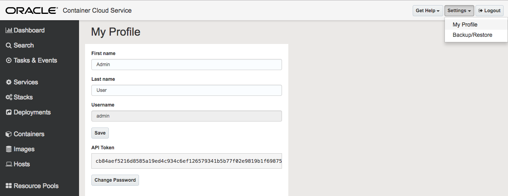

브라우저에서 worker 호스트 public_ip 주소 (예 :`http : //140.86.1.96 : 8080`)를 가리키는 URL을 엽니 다. 

롤링 라우터 고정 세션 GUI가 설정 화면과 함께 표시됩니다. 

OCCS 관리 호스트 IP, API 토큰 (무기명), 응용 프로그램 이름`docker-hello-world` 및 Docker 응용 프로그램의 기본 호스트 포트 (예 : 3000)를 입력하십시오. 

확인을 누릅니다. 주어진 OCCS admin IP 및 API 토큰을 사용한 로그인이 성공적이면 다음 화면이 나타납니다. 

로그인에 실패하면 다음 오류가 표시됩니다. 

드롭 다운에서 다음 값을 선택하여 hello world 응용 프로그램 배포의 초기 키 값을 만듭니다. 

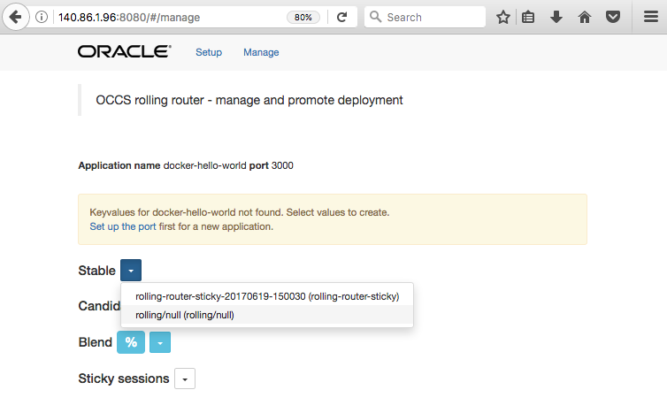

다음과 같이 값을 설정하십시오. 

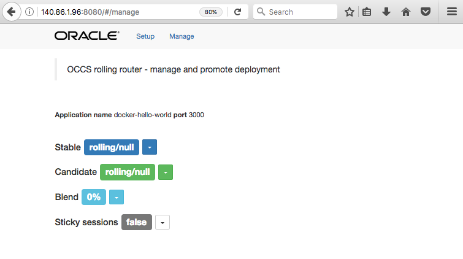

이렇게하면 호스트 포트 3000에 hello world 응용 프로그램의 OCCS 키 값에 값이 저장됩니다. 

### 기존 애플리케이션의 GUI 로그인 및 키 값

수동으로 또는 롤링 라우터 고정 세션 GUI를 사용하여 keyvalues를 이미 작성한 경우 로그인에서 포트를 지정할 필요가 없습니다. 그런 다음 로그인 / 설정 확인 버튼을 클릭하면 GUI가 자동으로 키 값을 찾습니다 (로그인이 성공한 경우). 발견 된 포트는 페이지의 응용 프로그램 이름과 함께 표시됩니다. 

또한 admin 또는 REST API를 사용하여 OCCS에서 keyvalues가 변경되면 GUI는 최대 지연이 짧은 후 자동으로 변경 사항을 감지합니다. 10 초. 

## Wercker CI / CD 설정하기

### Wercker 용 Hello World 애플리케이션 기본 이미지 빌드하기
<pre>
RUN sudo apt-get -y install libc-dev-bin libc6 libc6-dev
RUN sudo apt-get install -y recode
RUN sudo apt-get install -y jq
RUN sudo apt-get install -y curl
RUN sudo curl -sL https://deb.nodesource.com/setup_7.x | sudo -E bash -
RUN sudo apt-get install -y nodejs
RUN sudo apt-get install -y build-essential
</pre>
<pre>
mkdir ubuntu
git clone git@github.com:mikarinneoracle/docker-brew-ubuntu-core.git ubuntu
cd ubuntu
git checkout dist
cd trusty
export tag=$(docker build -t ubuntu . | grep 'Successfully built' | tail -c 13)
docker tag $tag <b>mikarinneoracle</b>/ubuntu:trusty
docker push mikarinneoracle/ubuntu
</pre>

<pre>
FROM mikarinneoracle/ubuntu:trusty

# Create app directory; same as Wercker default
RUN mkdir -p /pipeline/source
WORKDIR /pipeline/source

# Install app dependencies
COPY package.json /pipeline/source/
RUN npm install

# Bundle app source
COPY . /pipeline/source/

EXPOSE 3000
CMD [ "npm", "start" ]
</pre>
<pre>
mkdir hello-world
git clone git@github.com:mikarinneoracle/hello-world.git hello-world
cd hello-world
export tag=$(docker build -t hello-world . | grep 'Successfully built' | tail -c 13)
docker tag $tag <b>mikarinneoracle</b>/hello-world:latest
docker push mikarinneoracle/hello-world
</pre>

### Wercker 워크 플로 만들기

Wercker 계정에 로그인하고 방금 작성한 Node.js 응용 프로그램에 대한 Wercker`application` Hello world를 작성하십시오. 

그런 다음`build` (기본값)와`deploy` 두 단계로 Wercker`workflow`를 생성하십시오. 

새로운`step` deploy를 추가하십시오 : 

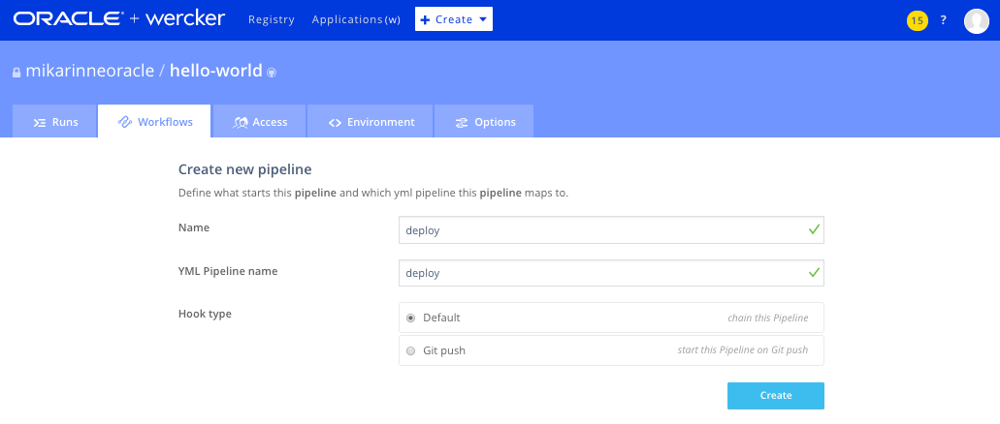

빌드 단계 후 워크 플로에 추가하십시오. 

YML 파이프 라인 이름은 파이프 라인 이름과 동일합니다. 

### 워크 플로우에 대한 Wercker 응용 프로그램 환경 값 작성
<pre>
  SERVICE_MANAGER:    OCCS admin url e.g. https://140.86.1.162
  API_TOKEN:          OCCS API token (bearer)
  APP_NAME:           docker-hello-world
  APP_FRIENDLY_NAME:  Hello-world  
  DOCKER_EMAIL:       Docker hub account email
  DOCKER_USERNAME:    Docker hub account username
  DOCKER_PASSWORD:    Docker hub account password
  DOCKER_REGISTRY:    Docker hub registry; typically the same as the username e.g. mikarinneoracle
  EXPOSED_PORT:       Hello world application host port e.g. 3000
  IMAGE_NAME:         Wercker.yml box name e.g. hello-world
  APP_TAG:            Wercker.yml box tag e.g. latest
  SCALE_AMOUNT:       OCCS scale amount e.g. 1
  DOCKER_CMD:         OCCS image command e.g. npm start (for Node.js)
</pre>

### 워크 플로로 첫 번째 빌드 시작

응용 프로그램 환경 변수를 설정 한 후 아래와 같이 &#39;지금 빌드 실행&#39;링크를 클릭하여 첫 번째 빌드를 시작할 수 있습니다. 

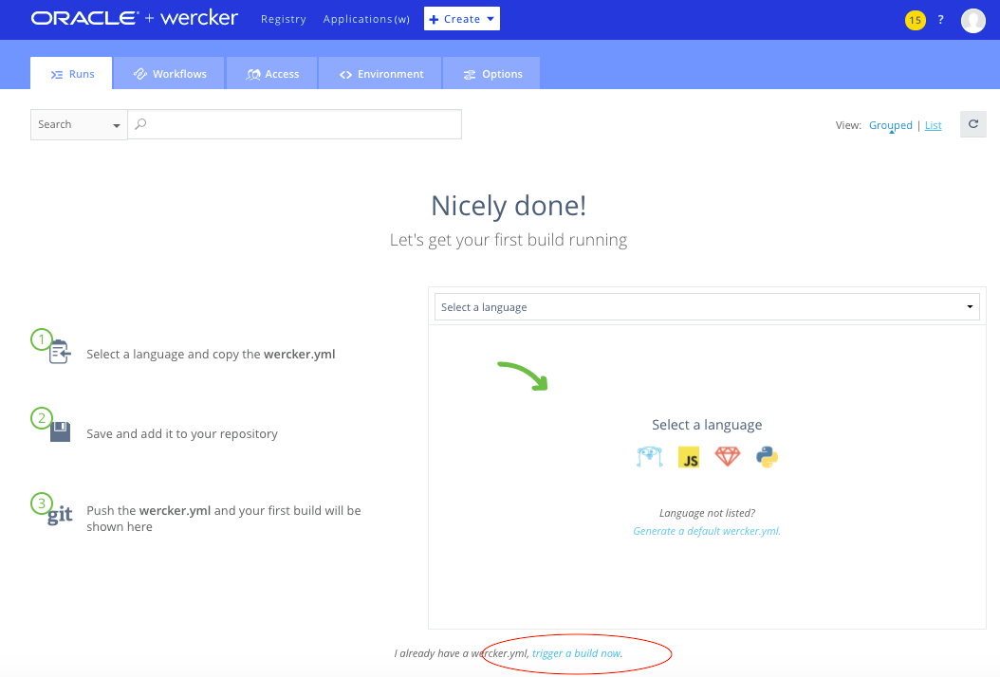

워크 플로가 시작되고 워크 플로가 실행됩니다. 

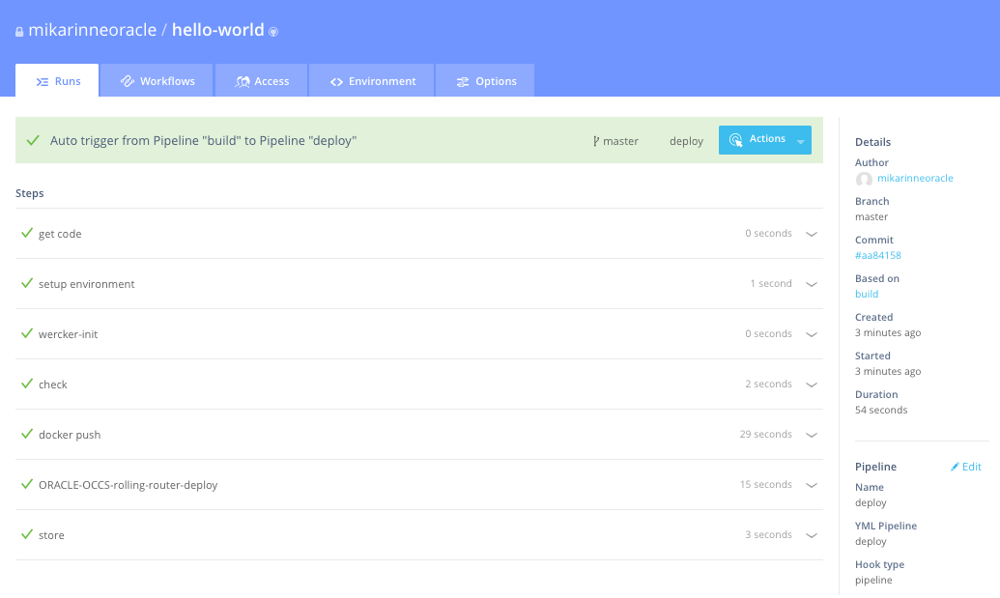

`timestamp` 태그가있는 Hello world 어플리케이션 candidate 이미지 (즉, 배포 스크립트의 Wercker 환경 변수`$ WERCKER_MAIN_PIPELINE_STARTED`)가 작성되어 Docker 허브에 푸시되었습니다. 

새 이미지도 OCCS에 배포되었으며 Hello World 응용 프로그램의 candidate 이미지가 실행 중이어야합니다. 

롤링 라우터 고정 세션 GUI가 응용 프로그램 candidate에 대한 OCCS의 키 값 변경을 반영하도록 업데이트되었습니다. 

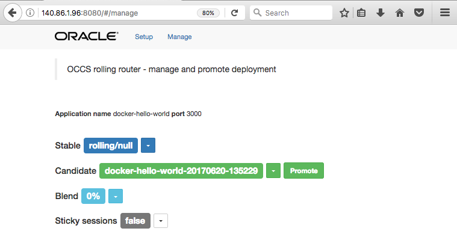

### candidate 이미지 홍보 및 브라우저에서 stable 애플리케이션 호출

롤링 라우터 고정 세션 GUI에서 승격 버튼을 클릭하여 candidate를 &#39;stable으로&#39;승격시킵니다. 결과는 안정 버전이 지금 Wercker에 의해 작성된 이미지이고 candidate가 롤링 / 널인 것입니다. 

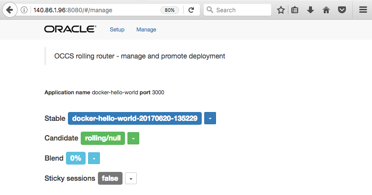

이제 브라우저에 새 탭을 열고 작업자 호스트 public_ip 주소 (예 : http : // 140.86.1.96)를 가리키는 URL을 열어 응용 프로그램의 안정 버전을 호출 할 수 있습니다. 

(배경색과 텍스트가 약간 다를 수 있음) 

페이지를 몇 번 새로 고침하여 응답하는지 확인할 수 있습니다. 

### 새로운 candidate Build
<pre>
git add index.html
git commit -m 'v.1.0.1'
git push origin master
</pre>

Wercker는이 변경 사항을 자동으로 선택해야하며 Hello world의 새 candidate 버전에 대한 워크 플로가 시작됩니다. 

새 태그가있는 candidate 이미지를 Docker 허브에 업로드해야합니다. 

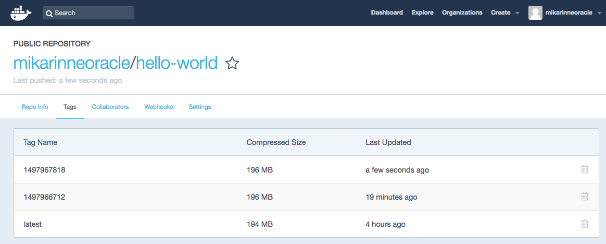

그것은 OCCS에서 전개되고 시작되어야 하며 이제는 stable, candidate 모두 실행되어야 합니다. 

이제 롤링 라우터 고정 세션 GUI가 candidate와 함께 업데이트되어 응용 프로그램 candidate에 대한 OCCS 키 값의 변경 사항을 반영해야합니다. 

### candidate 버전으로로드 보내기

두 버전이 모두 실행 중이기 때문에 candidate 버전을 로드하여 테스트 할 수 있습니다. 이렇게하려면 혼합 비율을 50%로 조정하십시오. 

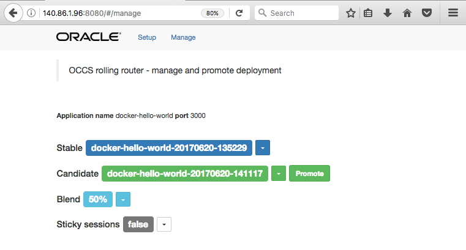

이제 worker_ public_ip 주소 인 http://140.86.1.96 &#39;과 같은 다른 요청은 candidate 버전으로 이동해야합니다. 

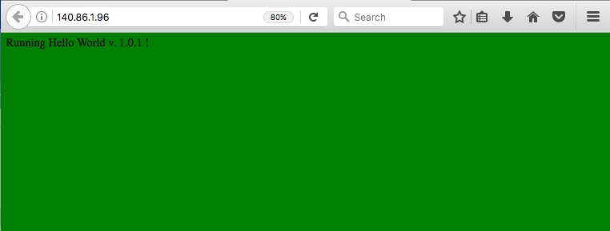

문제를 보려면 페이지를 다시로드하십시오. 예를 들어 혼합 비율을 100으로 설정하면 모든 요청이 candidate자에게 전달됩니다. 

#### 새로운 candidate 버전 재구성 

CI / CD 파이프 라인이 현재 작동하고 있으므로 새로운 버전의 candidate를 쉽게 구축 할 수 있습니다. 배경색을 주황색으로 설정 한 다음 변경 사항을 커밋하고 밀어 넣는 것처럼 index.html을 다시 변경하십시오. 

다시 말하지만 새로운 Hello world 응용 프로그램 이미지가 작성되어 태그가있는 Docker 허브에 업로드됩니다. 기존 candidate자는 OCCS의 새로운 candidate자로 대체되어야합니다. 

그리고 새로운 candidate는 롤링 라우터 sticky 세션 GUI에서 blend % zero로 업데이트되어야합니다 : 

이제 블렌드 %를 늘리고 블렌드 %에 따라 응용 프로그램 페이지를 수 차례 리얼 뷰 할 수 있습니다. 결국 새 버전이 나타납니다. 

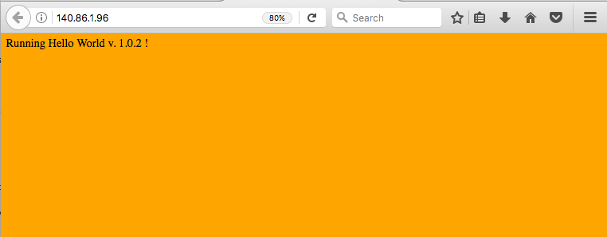

#### 새로운 candidate를 Stable로 승격하기 

언제든지 candidate를 Stable로 승격시킬 수 있습니다. 그런 다음 블렌드가 0이되고 롤링 라우터 고정 세션은 stable 버전으로 요청 만 보냅니다. 그런 다음 변경 사항을 작성한 새 candidate를 배치하고 이를 저장소로 밀어 넣고 candidate자 프로세스를 이전과 같이 다시 시작합니다. 

또한 GUI의 드롭 다운에서 해당 값을 선택하여 stable 값과 candidate 값으로 재생하여 응용 프로그램 페이지를 다시로드 할 때의 효과를 확인합니다. 롤링 라우터의 고정 세션 구성이 값을 변경 한 후로드되는 동안 잠시 지연됩니다. 응용 프로그램 페이지를 너무 빨리 다시 로드하면 게이트웨이 오류가 발생할 수 있습니다. 이 경우 페이지를 새로 고침하십시오. 

### Stable상태와 candidate 사이의 세션 Sticky

지금까지는 세션 Sticky 를 사용하지 않았습니다. 

stickyness를 true로 설정하기 만하면 됩니다. 

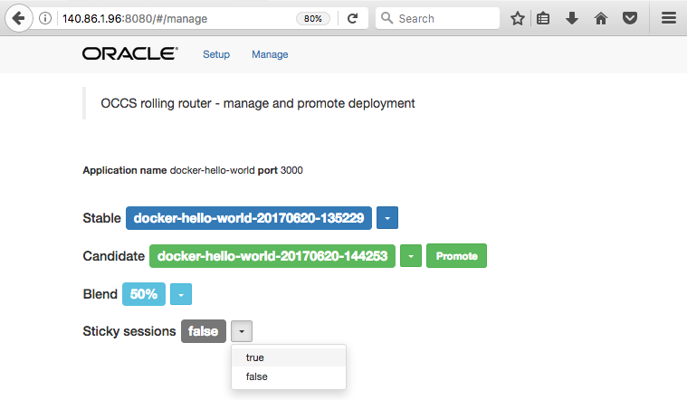

<i>동일한</i> 클라이언트 (예 : 브라우저)의 모든 후속 요청은 초기에 도달 한 응용 프로그램 버전 (블렌드 % 기준)에 따라 안정된 응용 프로그램 또는 candidate 응용 프로그램 버전으로 이동해야합니다. 이는 세션 선호도를 유지해야한다는 것을 의미하며 사용자는 항상 동일한 버전의 응용 프로그램을 시험해야합니다. 

세션 stickyness가 false로 설정되면 클라이언트는 응용 프로그램 버전 (stable 또는 candidate)에서 순수하게 혼합 %를 기반으로 제공되며 세션 선호도는 적용되지 않습니다. 

로드 테스트 응용 프로그램을 사용하지 않고 테스트하는 것이 더 어려울 수 있으므로이 동작을 경험하기 위해 세션 고정이 true로 설정된 경우 응용 프로그램에 요청을하기 위해 여러 브라우저를 열어 볼 수 있습니다. 

실제 응용 프로그램 테스트에서 세션 Sticky 함은 웹 응용 프로그램의 경우 사용자가 일관된 사용자 환경을 볼 수 있도록하는 데 중요합니다. 그러나 마이크로 서비스 테스트에서 세션 연관 관계는 더 적은 값을 가지며 false로 설정할 수 있습니다. 

## Wercker.yaml 및 Wercker 레지스트리 단계
<pre>
box:
    id: $DOCKER_REGISTRY/$IMAGE_NAME
    tag: $APP_TAG
    registry: https://registry.hub.docker.com
</pre>
<pre>
build:
  steps:
    - npm-install
</pre>
<pre>
deploy:
  steps:
    - script:
        name: check
        code: |
            npm --version
            node --version
            jq --version
            curl --version
            recode --version
        username: $DOCKER_USERNAME
        password: $DOCKER_PASSWORD
        tag: $WERCKER_MAIN_PIPELINE_STARTED
        repository: $DOCKER_REGISTRY/$IMAGE_NAME
        registry: https://registry.hub.docker.com
</pre>

첫 번째 단계 인 '확인'은 Oracle Container Cloud 서비스에 대한 실제 배포에 필요한 필수 기능을 갖춘 올바른 이미지로 박스를 구축했는지 확인하는 것입니다.

두 번째 단계 인`internal / docker-push`는 빌드 된 이미지를 Docker-hub 저장소로 푸시합니다. 여기에서는 푸시 된 이미지의 태그로`$ WERCKER_MAIN_PIPELINE_STARTED` 타임 스탬프를 사용하고 있습니다.

배포 파이프 라인의 최종 단계 및 전체 워크 플로는 Oracle Container Cloud 서비스에 대한 실제 배포입니다.

이것은 `mikarinneoracle/ORACLE-OCCS-rolling-router-deploy@1.0.0` 이름을 갖고 있는 <a href="https://app.wercker.com/search/steps/oracle">Wercker registry</a>에 있는 레지스트리 단계에서 수행됩니다.

