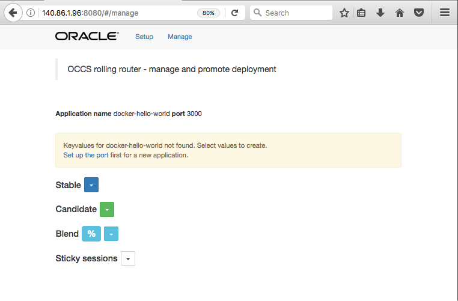
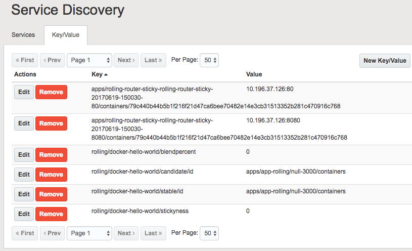

# Wercker로 루팅 라우터 끈적 세션

## 롤링 라우터의 끈적한 세션 서비스 배포

### 저장소 복제

<pre>
mkdir 도커 이미지 git clone git@github.com : oracle / docker-images.git 도커 이미지 cd 도커 이미지 / ContainerCloud 
</pre>

### Docker Hub에 로그인하십시오.
Docker 이미지를 만들고 Docker 허브에 푸시 할 것입니다. Docker 허브로 푸시하려면 Docker Hub로 인증해야합니다. 다음 명령을 사용하여 터미널을 열고 Docker Hub에 로그인하십시오. 

<pre>
도커 로그인 
</pre>

그러면 사용자 이름과 암호를 묻는 메시지가 나타납니다. Docker 허브 계정 이름을 입력하십시오 (귀하의 이메일 주소는 아님). 웹 브라우저에서 Docker Hub에 로그인하고 Docker Hub 웹 사이트의 상단 네비게이션에서 아바타 옆에있는 이름을 찾는 방법으로 찾을 수 있습니다. 

<pre>
Docker ID로 로그인하여 Docker Hub에서 이미지를 밀거나 당깁니다. Docker ID가없는 경우https://hub.docker.com으로 이동하여 ID를 만듭니다. 사용자 이름 : 비밀번호 : 로그인 성공 
</pre>

### Docker 허브 계정을 사용하도록 작성기 구성

첫 번째 스택을 만들기 전에 [images/build/vars.mk](images/build/vars.mk) and set the registry name variable as your Docker Hub account (usernames should be entered in lower case)를 엽니 다. 

<pre>
REGISTRY_NAME? = your_docker_hub_username 
</pre>

### 이미지 빌드

make를 사용하여`rolling-router-sticky-sessions` 이미지를 빌드하십시오 : 

<pre>
cd 이미지 / 롤 - 라우터 - 끈적 세션 만들기 
</pre>

이렇게하면 Docker-hub에 이미지가 업로드됩니다. 

### OCCS 서비스 만들기

OCCS에 로그인하고 이미지 저장소가 Docker-hub 계정 (굵게 표시됨)을 참조하는 다음 YML을 사용하여 &#39;rolling-router-sticky&#39;라는 새 서비스를 만듭니다. 

<pre>
버전 : 2 개 서비스 : 롤링 라우터 스티커 : 이미지 : &#39; <b>mikarinneoracle</b> / rolling-router-sticky- <b>sessions</b> :0.2&#39;환경 : 
- &#39;OCCS_API_TOKEN = {{api_token}}&#39; 
- KV_IP = 172.17.0.1 
- KV_PORT = 9109 
- APP_NAME = docker-hello-world 
- &#39;occs : 가용성 = 풀당&#39; 
- &#39;occs : scheduler = random&#39;포트 : 
- &#39;80 : 80 / tcp &#39; 
- &#39;8080 : 8080 / tcp&#39;</pre>

자신의 이미지를 빌드하지 않은 경우 위의 YML을 그대로 사용할 수 있습니다. 

서비스를 배포하십시오. 

## GUI를 사용하여 롤링 라우터 고정 세션 키 값 배포

OCCS admin에서 worker 호스트`public_ip`를 확인하십시오 : 

설정 / 내 프로필에서 &#39;API 토큰&#39;이라는 별명을 확인하십시오. 

브라우저에서 worker 호스트 public_ip 주소 (예 :`http : //140.86.1.96 : 8080`)를 가리키는 URL을 엽니 다. 

롤링 라우터 고정 세션 GUI가 설정 화면과 함께 표시됩니다. 

OCCS 관리 호스트 IP, API 토큰 (무기명), 응용 프로그램 이름`docker-hello-world` 및 Docker 응용 프로그램의 기본 호스트 포트 (예 : 3000)를 입력하십시오. 

확인을 누릅니다. 주어진 OCCS admin IP 및 API 토큰을 사용한 로그인이 성공적이면 다음 화면이 나타납니다. 

로그인에 실패하면 다음 오류가 표시됩니다. 

드롭 다운에서 다음 값을 선택하여 hello world 응용 프로그램 배포의 초기 키 값을 만듭니다. 

다음과 같이 값을 설정하십시오. 

이렇게하면 호스트 포트 3000에 hello world 응용 프로그램의 OCCS 키 값에 값이 저장됩니다. 

### 기존 애플리케이션의 GUI 로그인 및 키 값

수동으로 또는 롤링 라우터 고정 세션 GUI를 사용하여 keyvalues를 이미 작성한 경우 로그인에서 포트를 지정할 필요가 없습니다. 그런 다음 로그인 / 설정 확인 버튼을 클릭하면 GUI가 자동으로 키 값을 찾습니다 (로그인이 성공한 경우). 발견 된 포트는 페이지의 응용 프로그램 이름과 함께 표시됩니다. 

또한 admin 또는 REST API를 사용하여 OCCS에서 keyvalues가 변경되면 GUI는 최대 지연이 짧은 후 자동으로 변경 사항을 감지합니다. 10 초. 

## Wercker CI / CD 설정하기

### Wercker 용 Hello World 애플리케이션 기본 이미지 빌드하기

롤링 라우터의 sticky 세션 인 OCCS의 Wercker CI / CD 스크립트는`jq`,`recode`,`curl`과 같은 유틸리티를 사용하기 때문에 Hello world`Node.js` 응용 프로그램의 기본 이미지로`Ubuntu`를 선택했습니다. 

#### Node.js와 필수 유틸리티로 우분투 빌드하기 

먼저`scratch`에서 포함 된 유틸리티로 Ubuntu 이미지를 만든 다음 빌드 된 Ubuntu 이미지를 사용하여 롤링 라우터 고정 세션 배포를위한 실제 Hello World 응용 프로그램 이미지를 만듭니다. 

다음은 Ubuntu 이미지에서 Node.js와 함께 유틸리티를 사용할 수 있도록 다음과 같이 추가 된 forked Ubuntu 프로젝트의 <a href="https://github.com/mikarinneoracle/docker-brew-ubuntu-core/blob/dist/trusty/Dockerfile#L50">Dockerfile</a> 입니다. 

<pre>
실행 sudo apt-get -y 설치 libc-dev-bin libc6 libc6-dev 실행 sudo apt-get 설치 -y recode 실행 sudo apt-get 설치 -y jq 실행 sudo apt-get 설치 -y curl 실행 sudo curl -sL` https://deb.nodesource.com/setup_7.x | sudo -E bash - 실행 sudo apt-get install -y nodejs 실행 sudo apt-get install -y build-essential 
</pre>

`dist` 브랜치와`trusty` 버젼을 사용하여 프로젝트를 복제하고 이미지를 빌드하고 Docker 허브를 밀어 넣을 수 있습니다 (저장소를 Docker 허브 계정에 맞게 굵게 변경하십시오) : 

<pre>
mkdir 우분투 git clone git@github.com : mikarinneacle / docker-brew-우분투 core.git 우분투 cd 우분투 git checkout dist CD 신뢰할만한 export tag = $ (도커 빌드 -t 우분투. | grep &#39;성공적으로 빌드 됨 | tail -c 13) 도커 태그 $ tag <b>mikarinneoracle</b> / 우분투 : 신뢰할 수있는 도커 푸시 mikarinneoracle / 우분투 
</pre>

#### Hello world 응용 프로그램 이미지 빌드 

커스텀 빌드 우분투 이미지를 사용하여 Node.js Hello world 어플리케이션을 빌드하십시오. <a href="https://github.com/mikarinneoracle/hello-world">소스 코드</a> 에는 다음과 같은 Dockerfile이 포함되어 있습니다. 

<pre>
FROM mikarinneoracle / 우분투 : 믿을만한 

# 앱 디렉토리를 만듭니다. 베커 기본값과 동일
mkdir -p / pipeline / source 작업 디렉토리 / 파이프 라인 / 소스 실행 

# 앱 의존성 설치
COPY package.json / pipeline / source / RUN npm install 

# 번들 앱 소스
복사. / 파이프 라인 / 소스 / 

EXPOSE 3000 CMD [ &quot;npm&quot;, &quot;start&quot;] 
</pre>

프로젝트를 복제 한 다음 이미지를 작성하여 Docker 허브에 푸시 할 수 있습니다 (Docker 허브 계정과 일치하도록 리포지토리를 굵게 변경). 

<pre>
mkdir hello-world git clone git@github.com : mikarinneoracle / hello-world.git hello-world cd hello-world 내보내기 태그 = $ (도커 빌드 -t hello-world | grep &#39;성공적으로 빌드 됨 | tail -c 13 ) 도커 태그 $ tag <b>mikarinneoracle</b> / hello-world : 최신 도커 push mikarinneoracle / hello-world 
</pre>

### Wercker 워크 플로 만들기

Wercker 계정에 로그인하고 방금 작성한 Node.js 응용 프로그램에 대한 Wercker`application` Hello world를 작성하십시오. 

그런 다음`build` (기본값)와`deploy` 두 단계로 Wercker`workflow`를 생성하십시오. 

새로운`step` deploy를 추가하십시오 : 

빌드 단계 후 워크 플로에 추가하십시오. 

YML 파이프 라인 이름은 파이프 라인 이름과 동일합니다. 

### 워크 플로우에 대한 Wercker 응용 프로그램 환경 값 작성

Wercker 워크 플로에 대한 다음 응용 프로그램 환경 값을 만듭니다. 

<pre>
SERVICE_MANAGER : OCCS admin url 예 :https://140.86.1.162 API_TOKEN : OCCS API 토큰 (무기명) APP_NAME : docker-hello-world APP_FRIENDLY_NAME : Hello World DOCKER_EMAIL : Docker 허브 계정 이메일 DOCKER_USERNAME : Docker 허브 계정 사용자 이름 DOCKER_PASSWORD : Docker 허브 계정 암호 DOCKER_REGISTRY : 도커 허브 레지스트리; 일반적으로 사용자 이름과 동일합니다. 예 : mikarinneacle EXPOSED_PORT : Hello world 응용 프로그램 호스트 포트 (예 : 3000) IMAGE_NAME : Wercker.yml 상자 이름 예 hello-world APP_TAG : Wercker.yml 상자 태그 예 : SCALE_AMOUNT : OCCS 눈금 크기 예 1 DOCKER_CMD : OCCS image command eg npm start (Node.js의 경우) 
</pre>

### 워크 플로로 첫 번째 빌드 시작

응용 프로그램 환경 변수를 설정 한 후 아래와 같이 &#39;지금 빌드 실행&#39;링크를 클릭하여 첫 번째 빌드를 시작할 수 있습니다. 

워크 플로가 시작되고 워크 플로가 실행됩니다. 

`timestamp` 태그가있는 Hello world 어플리케이션 후보 이미지 (즉, 배포 스크립트의 Wercker 환경 변수`$ WERCKER_MAIN_PIPELINE_STARTED`)가 작성되어 Docker 허브에 푸시되었습니다. 

새 이미지도 OCCS에 배포되었으며 Hello World 응용 프로그램의 후보 이미지가 실행 중이어야합니다. 

롤링 라우터 고정 세션 GUI가 응용 프로그램 후보에 대한 OCCS의 키 값 변경을 반영하도록 업데이트되었습니다. 

### 후보 이미지 홍보 및 브라우저에서 안정적인 애플리케이션 호출

롤링 라우터 고정 세션 GUI에서 승격 버튼을 클릭하여 후보를 &#39;안정적으로&#39;승격시킵니다. 결과는 안정 버전이 지금 Wercker에 의해 작성된 이미지이고 후보가 롤링 / 널인 것입니다. 

이제 브라우저에 새 탭을 열고 작업자 호스트 public_ip 주소 (예 : http : // 140.86.1.96)를 가리키는 URL을 열어 응용 프로그램의 안정 버전을 호출 할 수 있습니다. 

(배경색과 텍스트가 약간 다를 수 있음) 

페이지를 몇 번 새로 고침하여 응답하는지 확인할 수 있습니다. 

### 새로운 후보 창립

배경색을 녹색으로 변경하고 버전을 1.0.1로 변경하는 편집기를 사용하여 Hello world`index.html`에 기회를 만들어보십시오. 변경 사항을 적용하고 변경 사항을 저장소로 푸시 : 

<pre>
git add index.html git commit -m &#39;v.1.0.1&#39;git push origin master 
</pre>

Wercker는이 변경 사항을 자동으로 선택해야하며 Hello world의 새 후보 버전에 대한 워크 플로가 시작됩니다. 

새 태그가있는 후보 이미지를 Docker 허브에 업로드해야합니다. 

그것은 OCCS에서 전개되고 시작되어야하며 이제는 안정적이고 후보자가 모두 실행되어야합니다. 

이제 롤링 라우터 고정 세션 GUI가 후보와 함께 업데이트되어 응용 프로그램 후보에 대한 OCCS 키 값의 변경 사항을 반영해야합니다. 

### 후보 버전으로로드 보내기

두 버전이 모두 실행 중이기 때문에 후보 버전을로드하여 테스트 할 수 있습니다. 이렇게하려면 혼합 비율을 50 %로 조정하십시오. 

이제 worker_ public_ip 주소 인http://140.86.1.96 &#39;과 같은 다른 요청은 후보 버전으로 이동해야합니다. 

문제를 보려면 페이지를 다시로드하십시오. 예를 들어 혼합 비율을 100으로 설정하면 모든 요청이 후보자에게 전달됩니다. 

#### 새로운 후보 버전 재구성 

CI / CD 파이프 라인이 현재 작동하고 있으므로 새로운 버전의 후보를 쉽게 구축 할 수 있습니다. 배경색을 주황색으로 설정 한 다음 변경 사항을 커밋하고 밀어 넣는 것처럼 index.html을 다시 변경하십시오. 

다시 말하지만 새로운 Hello world 응용 프로그램 이미지가 작성되어 태그가있는 Docker 허브에 업로드됩니다. 기존 후보자는 OCCS의 새로운 후보자로 대체되어야합니다. 

그리고 새로운 후보는 롤링 라우터 sticky 세션 GUI에서 blend % zero로 업데이트되어야합니다 : 

이제 블렌드 %를 늘리고 블렌드 %에 따라 응용 프로그램 페이지를 수 차례 리얼 뷰 할 수 있습니다. 결국 새 버전이 나타납니다. 

#### 새로운 후보를 안정적으로 홍보하기 

언제든지 후보자를 안정적으로 승격시킬 수 있습니다. 그런 다음 블렌드가 0이되고 롤링 라우터 고정 세션은 안정적인 버전으로 요청 만 보냅니다. 그런 다음 변경 사항을 작성한 새 후보를 배치하고이를 저장소로 밀어 넣고 후보자 프로세스를 이전과 같이 다시 시작합니다. 

또한 GUI의 드롭 다운에서 해당 값을 선택하여 안정적인 값과 후보 값으로 재생하여 응용 프로그램 페이지를 다시로드 할 때의 효과를 확인합니다. 롤링 라우터의 고정 세션 구성이 값을 변경 한 후로드되는 동안 잠시 지연됩니다. 응용 프로그램 페이지를 너무 빨리 다시로드하면 게이트웨이 오류가 발생할 수 있습니다. 이 경우 페이지를 새로 고침하십시오. 

### 안정과 후보 사이의 세션 끈적 함

지금까지는 세션 끈적임 (친근감이라고도 함)으로 아직 연주하지 않았습니다. 

stickyness를 true로 설정하기 만하면됩니다. 

<i>동일한</i> 클라이언트 (예 : 브라우저)의 모든 후속 요청은 초기에 도달 한 응용 프로그램 버전 (블렌드 % 기준)에 따라 안정된 응용 프로그램 또는 후보 응용 프로그램 버전으로 이동해야합니다. 이는 세션 선호도를 유지해야한다는 것을 의미하며 사용자는 항상 동일한 버전의 응용 프로그램을 시험해야합니다. 

세션 stickyness가 false로 설정되면 클라이언트는 응용 프로그램 버전 (stable 또는 candidate)에서 순수하게 혼합 %를 기반으로 제공되며 세션 선호도는 적용되지 않습니다. 

로드 테스트 응용 프로그램을 사용하지 않고 테스트하는 것이 더 어려울 수 있으므로이 동작을 경험하기 위해 세션 고정이 true로 설정된 경우 응용 프로그램에 요청을하기 위해 여러 브라우저를 열어 볼 수 있습니다. 

실제 응용 프로그램 테스트에서 세션 끈적 함은 웹 응용 프로그램의 경우 사용자가 일관된 사용자 환경을 볼 수 있도록하는 데 중요합니다. 그러나 마이크로 서비스 테스트에서 세션 연관 관계는 더 적은 값을 가지며 false로 설정할 수 있습니다. 

## Wercker.yaml 및 Wercker 레지스트리 단계

<a href="https://github.com/mikarinneoracle/hello-world/blob/master/wercker.yml">Wercker.yml</a> 은 Hello world 응용 프로그램에 포함되어 있습니다. 박스 정의와`build`와`deploy`라는 두 개의 파이프 라인으로 구성됩니다. 

상자 정의는 Ubuntu 위에 구축 된 Node.js 응용 프로그램 이미지를 기반으로합니다. 

<pre>
상자 : id : $ DOCKER_REGISTRY / $ IMAGE_NAME 태그 : $ APP_TAG 레지스트리 :https://registry.hub.docker.com 
</pre>

빌드 파이프 라인은 한 단계만으로 구성된 매우 간단합니다. 

<pre>
빌드 : 단계 : 
- npm-install</pre>

성공적인 빌드 파이프 라인 이후에 실행되는 배포 파이프 라인은 다음 세 단계를 통해 조금 더 복잡합니다. 

<pre>
배포 : 단계 : 
- 스크립트 :        name: check
        code: |
            npm --version
            node --version
            jq --version
            curl --version
            recode --version

- 내부 / 도커 푸시 :        username: $DOCKER_USERNAME
        password: $DOCKER_PASSWORD
        tag: $WERCKER_MAIN_PIPELINE_STARTED
        repository: $DOCKER_REGISTRY/$IMAGE_NAME
        registry: https://registry.hub.docker.com

- mikarinneoracle / ORACLE-OCCS-rolling-router-deploy@1.1.0</pre>

첫 번째 단계 인 &#39;확인&#39;은 Oracle Container Cloud 서비스에 대한 실제 배포에 필요한 필수 기능을 갖춘 올바른 이미지로 박스를 구축했는지 확인하는 것입니다. 

두 번째 단계 인`internal / docker-push`는 빌드 된 이미지를 Docker-hub 저장소로 푸시합니다. 여기에서는 푸시 된 이미지의 태그로`$ WERCKER_MAIN_PIPELINE_STARTED` 타임 스탬프를 사용하고 있습니다. 

배포 파이프 라인의 최종 단계 및 전체 워크 플로는 Oracle Container Cloud 서비스에 대한 실제 배포입니다. 이것은 <a href="https://app.wercker.com/search/steps/oracle">Wercker 레지스트리</a> 에서`mikarinneoracle / ORACLE-OCCS-rolling-router-deploy @ 1.0.0`라는 이름으로 발견되는`레지스트리 단계 &#39;로 수행됩니다 : 

이 소스 코드는 <a href="https://github.com/mikarinneoracle/ORACLE-OCCS-rolling-router-deploy">github.com/mikarinneoracle/ORACLE-OCCS-rolling-router-deploy</a> 에서 찾을 수 있으며`run.sh`와`Wercker-step.yml` 정의 파일을 포함하고 있습니다. 
